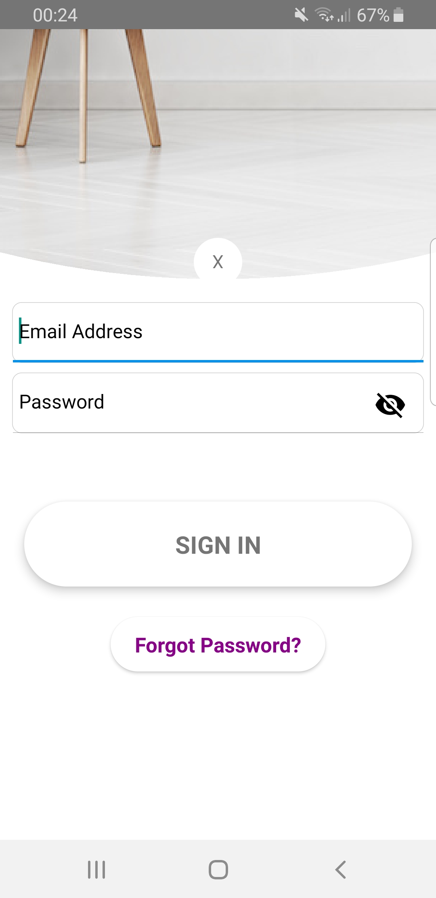
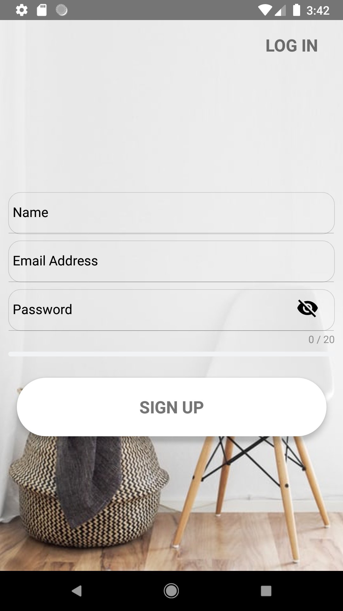
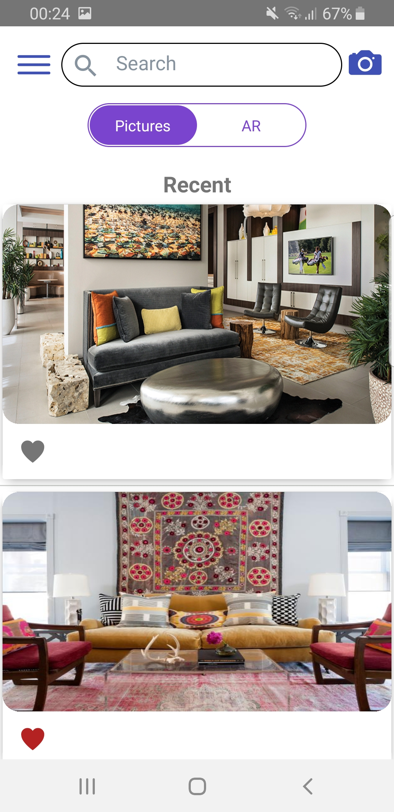
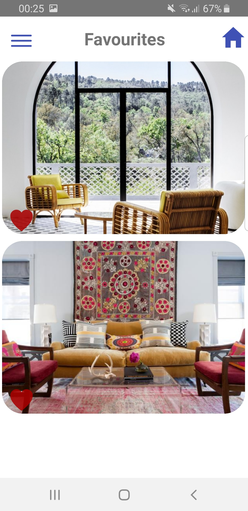
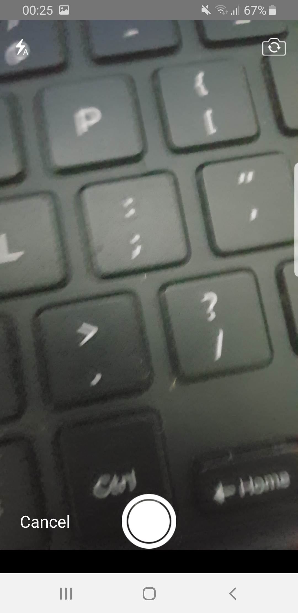

# InteriorDesignFYP

Interior Assistant is designed to detect interior objects through
camera, suggesting interior images related to it and giving them
Augmented Reality experience of 3D furniture objects. 
Made using ReactNative, Firebase, ViroMedia(AR Library), TensorFlow Lite

  
  
  

  
  
  

  
  
  

